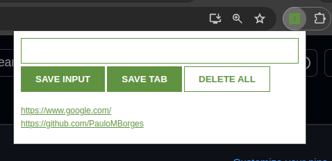

# Scrimba Lead Tracker Chrome Extension

This project (built as part of the [Scrimba's Learn JavaScript course](https://v2.scrimba.com/learn-javascript-c0v)) is a Chrome Extension that provides a convenient way to save URLs.

### Features:
- **Save URLs:** Easily add URLs manually or capture the current page's URL with the "Save Tab" button.
- **Manage Links:** View all saved links and delete them at once by double-clicking the "Delete all" button.
